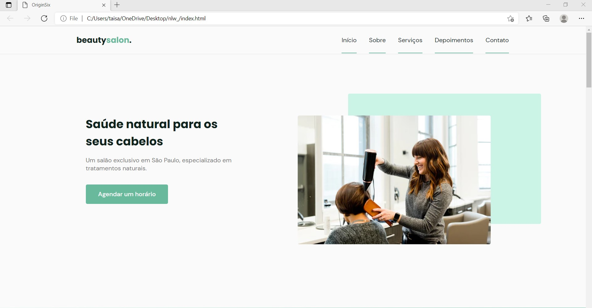
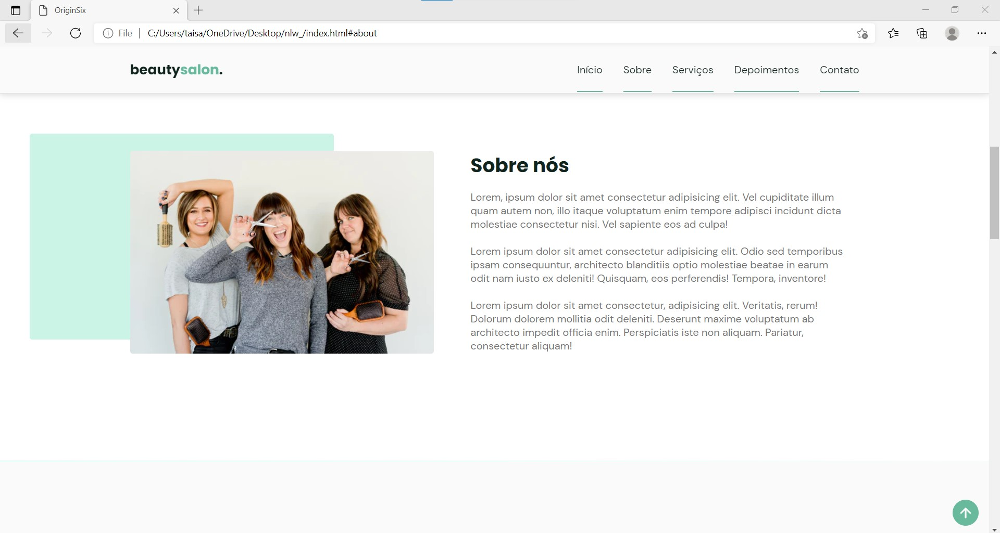
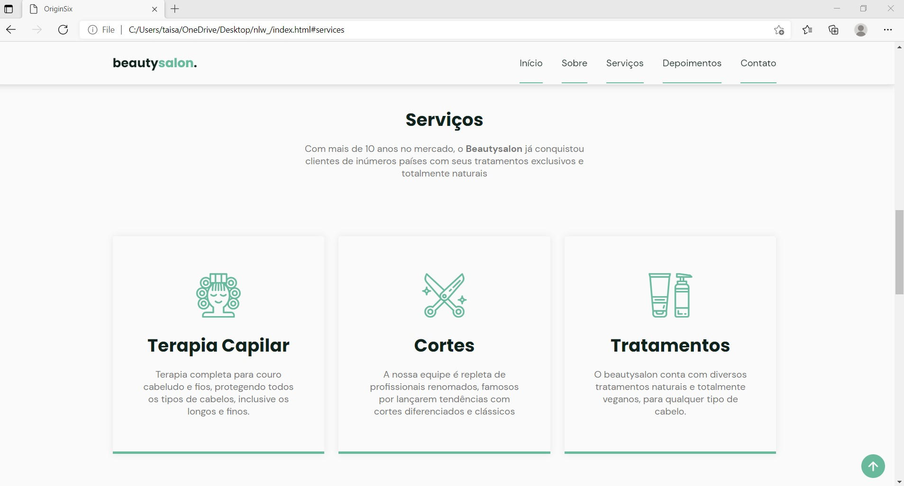
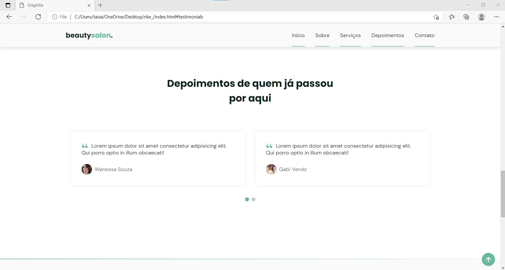
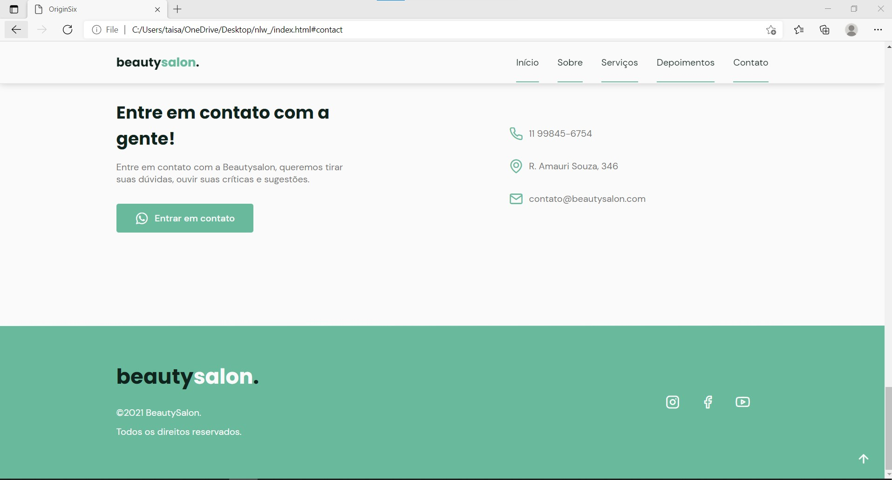

# Projeto NLW / Rocketseat

Projeto desenvolvido durante a 6° edição da NLW promovida pela Rocketseat, de 20 a 28 de junho.

Ferramentas utilizadas: HTML, CSS e JavaScript.

## Resultado

Durante a semana de cursos da NLW, ...

- <strong>HTML</strong>

  - Links no HTML para adicionar um layout mais interatido: 	
  - SWIPER
  - Icons
  - Fonts
  - ScroolReveal
  - -*ldquo;--- Para adicionar caracter representando "
  - blockquote --- Representa o conteúdo citado de outra fonte
  - cite --- representa uma referência a um trabalho criativo. Deve incluir o título da obra ou o nome do autor ou URL.
  - </a href="http://facebook.com" target="_blank"/></i class="icon-facebook"></i a = adiociona o link, target = blank, quando clicar no icone do link, abrirá numa nova página

  

- <strong>CSS</strong> 

  - List-style: Permite configurar os marcadores de uma lista, neste caso, none 
  - O elemento (:root) é para adicionar todas as variáveis de cores, tamanhos e fontes que será utilizada na construção da página
  - Scrool-behavior: especifica comprotamento do movimento de scrool da página
  - Display Grid: configura elementos em horizontal e vertical

  

  

